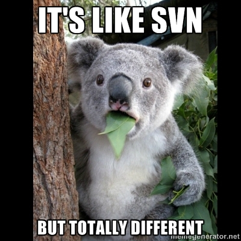

# Déploiement de niveau entreprise avec Git, Drush et Fabric

## Intro

<!--
Tous ceux qui ont eu à faire des déploiements se sentent un peu comme les héros du film Armageddon.
Here to save the day! et par la même occasion, de mettre les pieds sur un terrain encore peu explorer, mais énormement étudier.
Nous sommes ici aujourd'hui pour vous présentez une technique, une procédure que j'ai(Pierre Paul) testé par le passé et qui fonctionne.
La procédure en question impliquent quelques morceaux de robots assez important.
Certains énormement connus dans le monde Drupal, d'autres beaucoup moins.
La technique s'addresse surtout aux moyennes entreprises qui ont au moins un sysadmin ou des développeurs très débrouillards.
Vers la fin de la session, nous allons aussi vous présentez des pistes pour ajuster la technique dans un contexte de plus grosse entreprises.
-->

## But ultime

<!--
Voici notre but ultime. Nous allons passer en revue chacun des points et des technologies impliquées.
-->

## Drush

<!--
Drush est le couteau suisse Drupal. Il permet, via la ligne de commande, d'intéragir directement avec notre installation Drupal.
C'est un must dans notre technique si on veut avoir une démarche complêtement automatisée, sans aucune intéraction humaine.
Drush *fonctionne* sous Windows. Parfois plus simple et plus sécuritaire de travailler dans une machine virtuelle comme QuickStart.
-->

## Fonctions de Drush
- Télécharger des modules
- Activer/Désactiver des modules
- Déinstaller des modules
- Rouler les tests\*
- Vider les cache
- Cron
- Gérer les utilisateurs
- Récupérer et changer les valeurs des variables de configuration
- ...
<!--
Et beaucoup beaucoup plus.
-->

## Fonctions de Drush
- Plus de 50 commandes dans Drush core
- Plus de 100 modules qui s'intêgrent avec Drush

<!-- 
-->

## Fonctions de Drush
Chaque module peut définir ses propres actions drush.

## Pourquoi Drush est-il important?
Permet d'automatiser le plus de fonctions manuelle posible.
<!--
On veut éviter le plus possible les intéractions humaines dans le processsus.
Vider la cache, par exemple, est souvent un problème facile à régler avec Drush.
-->
## Pourquoi l'automatisation est-elle importante?
L'erreur est humaine.

Enlevons le facteur humain.

## Pourquoi Drush est-il important?
C'est peut-être un développeur junior, ou avec moi d'expérience avec Drupal qui va devoir pousser le code en ligne.
## Pourquoi Drush est-il important?
Tous les sysadmins sont malades.

## Pourquoi Drush est-il important?
Entendu chez un client : "En toute franchise, la documentation de projet, c'est pas notre force."
<!--
Drush et le processus complet, permet une sorte de documentation obligatoire implicite.
-->

## Comment installer Drush

Pear
-----
    pear channel-discover pear.drush.org
    pear install drush/drush

_Pear est brisé_ sur MacOSX Mountain Lion

    sudo cp /private/etc/php.ini.default /private/etc/php.ini
    sudo php /usr/lib/php/install-pear-nozlib.phar
    pear config-set php\_ini /private/etc/php.ini
    pecl config-set php\_ini /private/etc/php.ini  
    sudo pear upgrade-all

### Permet de mettre à jour facilement.
Les caneaux officiels sont toujours en retard sur le développement.

## Drush aliases

    $aliases['dev'] = array(
        'root' => '/path/to/drupal',
        'uri' => 'dev.mydrupalsite.com',
    );
    $aliases['live'] = array(
        'root' => '/other/path/to/drupal',
        'uri' => 'mydrupalsite.com',
    );

## Fonctions importantes
- sql-dump (drush @dev sql-dump > backup.sql)
- sql-connect (drush @live sql-connect)
- cache-clear all
<!---->

## Drush make
Compile en cascade un projet.

Télécharge tous les modules et les patchs spécifiées.

<!---->

## Drush make example

<https://github.com/Wiredcraft/example>

    core = "7.x"
    api = "2"
    ; Includes ====================================================================
    includes[] = "https://raw.github.com/makara/buildkit_plus_v7/master/base.make"
    ; Modules =====================================================================
    projects[mollom][type] = "module"
    projects[mollom][subdir] = "contrib"
    projects[mollom][version] = "1.1"

Petit site permettant de construire un make file pour Drush, pour un nouveau projet.

<http://drushmake.me>
<!--
Permet aussi d'installer des patches, mais publiques seulement. C'est volontaire.
-->

## Git?
C'est comme SVN, mais complêtement différend.

## Git
Git :
<http://git-scm.com/>

Beau tutoriel fait en collaboration avec CodeSchool, amusant et simple :
<http://try.github.com/>

## Branches
Git permet d'utiliser différentes branches, tout comme SVN. 

Dans notre schema, chaque branche correspond à un serveur.

Branche master = serveur dev

Branche stage = serveur de stage

Branche prod = serveur de production

## Pull
L'équivalent de `svn up`, permet d'aller chercher les derniers changements sur notre repos.

## Remotes
Un remote, en terme Git, correspond à une destination distante. Dans notre cas, on parle de nos serveurs Dev, Stage et Prod. 

Seul le serveur ayant Gitolite aura les remotes Dev, Stage et Prod configurés.

Git/Gitolite passe par SSH pour transferer les fichiers. Donc le machine de deploiement devra avoir sa clef SSH enregistrée sur les serveurs distants pour pousser les fichiers automatiquement (sans user input).

## Push
Action qui permet de pousser le code sur un remote.

<!--
Une belle fonctionnalité que l'on ne retrouve pas sur svn, Git permet d'envoyer le code sur un serveur (remote) distant.
-->

## Gitolite/Gitosis
Gitosis est mort, longue vie à Gitosis!

Dernier commit est en 2009.
Gitolite est complet et fonctionne bien.

- Permet d'assigner des permissions à des utilisateurs/groupes 

Le truc : centraliser un système de versionnage décentralisé afin de faire les déploiements.

## Fabric?
Petite librairie python permettant d'automatiser des tâches sur un ou des serveurs distants.

## Fabric
Peut facilement être remplacé par Jenkins.
Elle sert dans notre processus à déployer les bases de données entre chacun des serveurs.

Habituellement les développeurs vont avoir accès pour pousser les bases de données sur les serveurs de Dev et Stage.
Seulement le sysadmin ou la machine de déploiement a les droits pour pousser sur la machine de production.
<!--
Un truc important, le processus ne gère pas le "content staging". Node export peut aider le content staging, mais c'est loin d'être une solution fiable. Le projet Migrate fait beaucoup, mais cest long et compliqué quand ca marche pas.
-->

## Exemple Fabric
Exemple de script pour pousser la DB sur un serveur distant

    from fabric.api import *
    env.use_ssh_config = True

    @task(default=True)
    def pushDB(env='local'):
        local('drush @via sql-dump --result-file=/tmp/via-dump.sql')
        db_connect = local('drush sql-connect --uri=http://supersite.' + env +
        '.drupalcampmontreal.org', True)
        local(db_connect + ' < /tmp/via-dump.sql')

<!--
On suppose ici que les settings.php sont défiinis pour chacun des environnements dans sites/
C'est une mauvaise supposition, mais c'est important pour garder l'exemple le plus simple que possible.
-->
## Config SSH
Les dernieres versions peuvent lire dans la config SSH du client initiant les commandes.

    Host        supersite.stage
    HostName    10.111.222.333 
    User        deployuser

Avec ce snippet dans votre configuration, vous pouvez vous connecter avec `ssh supersite.stage` sans spécifier le port, le user ou le mot de passe (si la clef SSH est authoriser).

## Autres outils à considérer
C'est une belle technique qui reste quand même simple et flexible, mais difficile à maintenir quand le nombre de serveurs dépassent une trentaine.

## Jenkins
Pour ceux qui veulent se rendre au prochain niveau, Jenkins est là.

Jenkins vous permet de rouler les tests et peut être inséré dans le processus avant de faire un déploiement.
C'est long rouler les tests.

Il peut aussi être utiliser pour vérifier que les Coding Standards ont bien été suivis entre chacune des versions du site web.

## Ansible - Chef
<!--
D'autres solutions sont disponibles par contre pour aider à maintenir l'ajout de nouveau serveurs/sites.
Des solutions qui sont disponibles aux sysadmins qui permettent de gérer les configurations sur leur serveurs, mais qui peuvent aussi servir
à maintenir à jour 

- notre config ssh, 
- la création de users ou de sites dans notre gitolite, 
- s'assurer que Drush soit installé et à jour sur les serveurs, etc.
- authoriser automatiquement la clef SSH du user de deploy
-->
Ansible
---
Belle solution python, probablement la plus simple.

<http://ansible.cc/>

Le nouveau site web est beaucoup plus accessible et convivial.

Chef
----
Belle solution ruby un peu plus complexe. Stable avec beaucoup de développement.

<http://wiki.opscode.com/display/chef/Home>

Beaucoup de "cookbooks" sont développés par la communauté

<http://community.opscode.com/cookbooks>

Beaucoup d'autres solutions existent (cdist, puppet, bcfg2, etc) avec des niveaux de complexité variés.

<http://en.wikipedia.org/wiki/Comparison_of_open_source_configuration_management_software>

## Vagrant
Vagrant permet de créer des environnements virtualisés pour reproduire les serveurs de productions, mais avec le développeur en tête. 

Le développeur peut lancer Vagrant pour avoir un environnement de développement identique à celui de la production. Plus jamais vous allez entendre "Mais ça marche sur ma machine!"

<!--
C'est pas tout à fait vrai, mais ca aide à l'entendre beaucoup moins souvent.
-->

## Questions?
