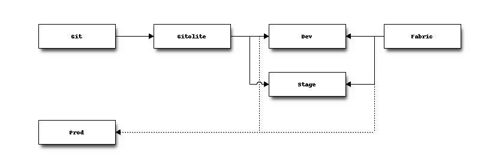
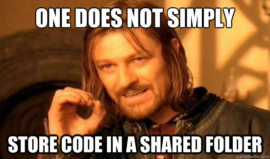
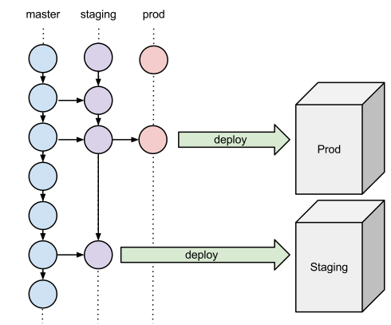

# Déploiement de niveau entreprise avec Git, Drush et Fabric

## Intro

<!--
Tous ceux qui ont eu à faire des déploiements se sentent un peu comme les héros du film Armageddon.
Here to save the day! et par la même occasion, de mettre les pieds sur un terrain encore peu explorer, mais énormement étudier.
Nous sommes ici aujourd'hui pour vous présentez une technique, une procédure que j'ai(Pierre Paul) testé par le passé et qui fonctionne.
La procédure en question impliquent quelques morceaux de robots assez important.
Certains énormement connus dans le monde Drupal, d'autres beaucoup moins.
La technique s'addresse surtout aux moyennes entreprises qui ont au moins un sysadmin ou des développeurs très débrouillards.
Vers la fin de la session, nous allons aussi vous présentez des pistes pour ajuster la technique dans un contexte de plus grosse entreprises.
-->

## But ultime

<!--
Voici notre but ultime. Nous allons passer en revue chacun des points et des technologies impliquées.
-->

## Le processus doit être automatisé ?
L'être humain est

 - lent
 - pas très fiable
 - approximatifs
 - doté de peu de mémoire

Les ordinateurs sont

 - rapides
 - fiables
 - precises
 - dotés d'une excellente mémoire

<!--
Deployer manuellement est _error prone_, l'automatisation permet d'éliminer les risques
d'oublis, d'erreur de manipulation, etc. Au prix d'un effert supplémentaire en
planification. Un processus automatisé est auto-documenté (pour peu qu'on écrive pas ces
script à la truelle).
-->

## Nos outils

- Drush
- Git
- Fabric

## Drush

<!--
Drush est le couteau suisse Drupal. Il permet, via la ligne de commande, d'intéragir directement avec notre installation Drupal.
C'est un must dans notre technique si on veut avoir une démarche complêtement automatisée, sans aucune intéraction humaine.
Drush *fonctionne* sous Windows. Parfois plus simple et plus sécuritaire de travailler dans une machine virtuelle comme QuickStart.
-->

## Fonctions de Drush
- Télécharger des modules
- Activer/Désactiver des modules
- Déinstaller des modules
- Rouler les tests\*
- Vider les cache
- Cron
- Gérer les utilisateurs
- Récupérer et changer les valeurs des variables de configuration
- ...
<!--
Et beaucoup beaucoup plus.
-->

## Drush est exentensible
- Plus de 100 modules qui s'intêgrent avec Drush
  
- Implementations de `hook`s pour définir ses propres commandes
<!--
-->

## Fonctions de Drush
<!--
Au final, Drush ca rassemblerait donc plutot à ca...
-->

## Pourquoi Drush est-il important?
 - Rapide
 - Simple
 - Complet
 - Scriptable
 - Automatisable
<!--
 Rapide => Une action qui prendrait plusieurs clicks/page loads se fait en une seule étape
 Simple => Les commandes sont généralement simples et effectue une seule action
 Complet => Il couvre la plupart des besoins (et est facilement extensible)
 Scriptable => Facile a exploiter depuis n'importe quel language de script orienté execution de commande
-->

## Comment installer Drush

### Pear
    pear channel-discover pear.drush.org
    pear install drush/drush

### Pear Windows Installer

http://www.drush.org/drush_windows_installer

### Gestionnaire de packages

   sudo aptitude install drush

## Comment installer Drush (Pear)
Pear est la solution la plus simple pour avoir rapidement accès à la dernière
version.

Mais Pear _est brisé_ sur MacOSX Mountain Lion

    sudo cp /private/etc/php.ini.default /private/etc/php.ini
    sudo php /usr/lib/php/install-pear-nozlib.phar
    pear config-set php\_ini /private/etc/php.ini
    pecl config-set php\_ini /private/etc/php.ini
    sudo pear upgrade-all

## Usage

    $  drush --root=/path/to/drupal --uri=dev.mydrupalsite.com status
     Drupal version         :  7.15
     Site URI               :  http://dev.mydrupalsite.com/
     Database driver        :  mysql
     Database hostname      :  localhost
     Database username      :  drupal
     Database name          :  drupal
     Default theme          :  garland
     Administration theme   :  seven
     PHP configuration      :  /etc/php-cli.ini
     Drush version          :  5.7
     Drush configuration    :  /home/fry/.drush/drushrc.php
     Drush alias files      :  /home/fry/.drush/aliases.drush.rc
     Drupal root            :  /path/to/drupal
     Site path              :  sites/default
     File directory path    :  sites/default/files
   $

## Configuration de Drush

### `drushrc.php`

### `aliases.drushrc.php`

    $aliases['dev'] = array(
        'root' => '/path/to/drupal',
        'uri' => 'dev.mydrupalsite.com',
    );
    $aliases['live'] = array(
        'root' => '/other/path/to/drupal',
        'uri' => 'mydrupalsite.com',
        'remote-host' => 'myprodserver.myisp.com',
        'remote-user' => 'publisher',
    );
<!-- -->

    drush @dev status

<!-- On ne s'étale pas, simple réference aux alias qui sont utile pour automatiser. -->

## Fonctions importantes
- `drush @dev sql-dump > backup.sql`
- `drush sql-sync @prod @dev`
- `drush rsync @dev @stage`
- `drush rsync ./ @stage:%files/img`
- `drush @dev clear-cache all`
- `drush @dev updatedb`
- `drush make mydrupalsite.make`

<!--
Expliquer brievement chaque commande et son usage dans le cadre d'un déploiement.
Permet aussi d'installer des patches, mais publiques seulement. C'est volontaire.
-->

## Git

## Git

 - Git est un logiciel de gestion de versions décentralisé.
 - Permet de maintenir l'historique du versions de code.
 - Support de nombreux _workflow_ d'édition et de partage de code.
 - Utilisé sur Drupal.org, requis pour contribué

 - <http://git-scm.com/>
 - <http://try.github.com/>
 - <http://drupal.org/documentation/git>

## Branches

## Deployer le code avec Git

Le déploiement se fait par mise à jour d'une dépot Git _local_ au serveur sur lequel on déploie.

### Pull

Récupérer les derniers changements dans un dépôt de code central depuis le serveur sur lequel on déploie.

### Push

Envoyer les derniers changements dans un dépot local vers le serveur sur lequel on déploie.

## Gitolite/Gitosis

Permet de facilement gérer un serveur de dépôts de code _centralisés_ avec un contrôle d'accès par utilisateurs et groupes d'utilisateurs.

Gitosis est mort, longue vie à Gitosis!

Dernier commit est en 2009.
Gitolite est complet et fonctionne bien.

<!-- Le truc : centraliser un système de versionnage décentralisé afin de faire les déploiements. -->

## Fabric

Librairie Python permettant d'automatiser des tâches sur un ou des serveurs distants.

    from fabric.api import run

    def host_type()
       run('uname -s')

<!-- -->

    $ fab -H localhost,linuxbox host_type
    [localhost] run: uname -s
    [localhost] out: Darwin
    [linuxbox] run: uname -s
    [linuxbox] out: Linux

    Done.
    Disconnecting from localhost... done.
    Disconnecting from linuxbox... done.

<!--

Peut facilement être remplacé par Jenkins.
Elle sert dans notre processus à déployer les bases de données entre chacun des serveurs.

Habituellement les développeurs vont avoir accès pour pousser les bases de données sur les serveurs de Dev et Stage.
Seulement le sysadmin ou la machine de déploiement a les droits pour pousser sur la machine de production.

Un truc important, le processus ne gère pas le "content staging". Node export peut aider le content staging, mais c'est loin d'être une solution fiable. Le projet Migrate fait beaucoup, mais cest long et compliqué quand ca marche pas.
-->

## Exemple Fabric
Exemple de script pour pousser la DB sur un serveur distant

    from fabric.api import *
    env.use_ssh_config = True

    @task(default=True)
    def pushDB(env='local'):
        local('drush @via sql-dump --result-file=/tmp/via-dump.sql')
        db_connect = local('drush sql-connect --uri=http://supersite.' + env +
        '.drupalcampmontreal.org', True)
        local(db_connect + ' < /tmp/via-dump.sql')

<!--
On suppose ici que les settings.php sont défiinis pour chacun des environnements dans sites/
C'est une mauvaise supposition, mais c'est important pour garder l'exemple le plus simple que possible.
-->
## Config SSH
Les dernieres versions peuvent lire dans la config SSH du client initiant les commandes.

    Host        supersite.stage
    HostName    10.111.222.333 
    User        deployuser

Avec ce snippet dans votre configuration, vous pouvez vous connecter avec `ssh supersite.stage` sans spécifier le port, le user ou le mot de passe (si la clef SSH est authoriser).

## Autres outils à considérer
C'est une belle technique qui reste quand même simple et flexible, mais difficile à maintenir quand le nombre de serveurs dépassent une trentaine.

## Jenkins
Pour ceux qui veulent se rendre au prochain niveau, Jenkins est là.

Jenkins vous permet de rouler les tests et peut être inséré dans le processus avant de faire un déploiement.
C'est long rouler les tests.

Il peut aussi être utiliser pour vérifier que les Coding Standards ont bien été suivis entre chacune des versions du site web.

## Ansible - Chef
<!--
D'autres solutions sont disponibles par contre pour aider à maintenir l'ajout de nouveau serveurs/sites.
Des solutions qui sont disponibles aux sysadmins qui permettent de gérer les configurations sur leur serveurs, mais qui peuvent aussi servir
à maintenir à jour 

- notre config ssh, 
- la création de users ou de sites dans notre gitolite, 
- s'assurer que Drush soit installé et à jour sur les serveurs, etc.
- authoriser automatiquement la clef SSH du user de deploy
-->
Ansible
---
Belle solution python, probablement la plus simple.

<http://ansible.cc/>

Le nouveau site web est beaucoup plus accessible et convivial.

Chef
----
Belle solution ruby un peu plus complexe. Stable avec beaucoup de développement.

<http://wiki.opscode.com/display/chef/Home>

Beaucoup de "cookbooks" sont développés par la communauté

<http://community.opscode.com/cookbooks>

Beaucoup d'autres solutions existent (cdist, puppet, bcfg2, etc) avec des niveaux de complexité variés.

<http://en.wikipedia.org/wiki/Comparison_of_open_source_configuration_management_software>

## Vagrant
Vagrant permet de créer des environnements virtualisés pour reproduire les serveurs de productions, mais avec le développeur en tête. 

Le développeur peut lancer Vagrant pour avoir un environnement de développement identique à celui de la production. Plus jamais vous allez entendre "Mais ça marche sur ma machine!"

<!--
C'est pas tout à fait vrai, mais ca aide à l'entendre beaucoup moins souvent.
-->

## Questions?
