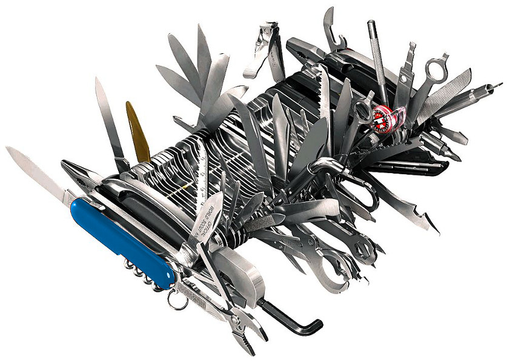

# Déploiement de niveau entreprise avec Git, Drush et Fabric

## Intro

<!--
Tous ceux qui ont eu à faire des déploiements se sentent un peu comme les héros du film Armageddon.
Here to save the day! et par la même occasion, de mettre les pieds sur un terrain encore peu explorer, mais énormement étudier.
Nous sommes ici aujourd'hui pour vous présentez une technique, une procédure que j'ai(Pierre Paul) testé par le passé et qui fonctionne.
La procédure en question impliquent quelques morceaux de robots assez important.
Certains énormement connus dans le monde Drupal, d'autres beaucoup moins.
La technique s'addresse surtout aux moyennes entreprises qui ont au moins un sysadmin ou des développeurs très débrouillards.
Vers la fin de la session, nous allons aussi vous présentez des pistes pour ajuster la technique dans un contexte de plus grosse entreprises.
-->

## But ultime

<!--
Voici notre but ultime. Nous allons passer en revue chacun des points et des technologies impliquées.
-->

## Drush

<!--
Drush est le couteau suisse Drupal. Il permet, via la ligne de commande, d'intéragir directement avec notre installation Drupal.
C'est un must dans notre technique si on veut avoir une démarche complêtement automatisée, sans aucune intéraction humaine.
Drush *fonctionne* sous Windows. Parfois plus simple et plus sécuritaire de travailler dans une machine virtuelle comme QuickStart.
-->

## Fonctions de Drush
- Télécharger des modules
- Activer/Désactiver des modules
- Déinstaller des modules
- Rouler les tests\*
- Vider les cache
- Cron
- Gérer les utilisateurs
- Récupérer et changer les valeurs des variables de configuration
- ...
<!--
Et beaucoup beaucoup plus.
-->

## Fonctions de Drush
- Plus de 50 commandes dans Drush core
- Plus de 100 modules qui s'intêgrent avec Drush

<!-- 
Chaque module peut définir ses actions drush qu'il supporte. 
@TODO expliquer comment supporter drush dans son module
-->

## Fonctions de Drush

## Pourquoi Drush est-il important?
Permet d'automatiser le plus de fonctions manuelle posible.
## Pourquoi Drush est-il important?
L'erreur est humaine.

Enlevons le facteur humain.

## Pourquoi Drush est-il important?
C'est peut-être un développeur junior qui va devoir pousser le code en ligne.
## Pourquoi Drush est-il important?
Tous les sysadmins sont malades.

## Pourquoi Drush est-il important?
Entandu chez un client : "En toute franchise, la documentation de projet, c'est pas notre force."

## Comment installer Drush
Pear
-----
    pear channel-discover pear.drush.org
    pear install drush/drush

_Pear est brisé_ sur MacOSX Mountain Lion

    sudo cp /private/etc/php.ini.default /private/etc/php.ini
    sudo php /usr/lib/php/install-pear-nozlib.phar
    pear config-set php\_ini /private/etc/php.ini
    pecl config-set php\_ini /private/etc/php.ini  
    sudo pear upgrade-all

### Permet de mettre à jour facilement.
Les caneaux officiels sont toujours en retard sur le développement.

## Drush aliases
    $aliases['dev'] = array(
        'root' => '/path/to/drupal',
        'uri' => 'dev.mydrupalsite.com',
    );
    $aliases['live'] = array(
        'root' => '/other/path/to/drupal',
        'uri' => 'mydrupalsite.com',
    );

## Fonctions importantes
- sql-dump (drush @dev sql-dump > backup.sql)
- sql-connect (drush @live sql-connect)
- cache-clear all

## Drush make
Compile en cascade un projet.

Télécharge tous les modules et les patchs spécifiées.
http://drushmake.me

## Drush make example
https://github.com/Wiredcraft/example

    core = "7.x"
    api = "2"
    ; Includes ====================================================================
    includes[] = "https://raw.github.com/makara/buildkit_plus_v7/master/base.make"
    ; Modules =====================================================================
    projects[mollom][type] = "module"
    projects[mollom][subdir] = "contrib"
    projects[mollom][version] = "1.1"

## Git?
C'est comme SVN, mais complêtement différend.

## Git
http://git-scm.com/
http://try.github.com/

## Branches
Git permet d'utiliser différentes branches, tout comme SVN. 

Dans notre schema, chaque branche correspond à un serveur.

Branche master = serveur dev

Branche stage = serveur de stage

Branche prod = serveur de production

## Pull
L'équivalent de `svn up`, permet d'aller chercher les derniers changements sur notre repos.

## Remotes
Un remote, en terme Git, correspond à une destination distante. Dans notre cas, on parle de nos serveurs Dev, Stage et Prod. 

Seul le serveur ayant Gitolite aura les remotes Dev, Stage et Prod configurés.

Git/Gitolite passe par SSH pour transferer les fichiers. Donc le machine de deploiement devra avoir sa clef SSH enregistrée sur les serveurs distants pour pousser les fichiers automatiquement (sans user input).
## Push
Action qui permet de pousser le code sur un remote.

## Gitolite/Gitosis
Gitosis est mort, longue vie à Gitosis!

Dernier commit est en 2009.
Gitolite est complet et fonctionne bien.

- Permet d'assigner des permissions à des utilisateurs/groupes 

Le truc : centraliser un système de versionnage décentralisé afin de faire les déploiements.

## Fabric?
Petite librairie python permettant d'automatiser des tâches sur un ou des serveurs distants.

## Fabric
Peut facilement être remplacé par Jenkins.

## Config SSH
Les dernieres versions peuvent lire dans la config SSH du client initiant les commandes.

## Autres outils à considérer
## Jenkins
## Ansible - Chef - Puppet - BCFG2
## Vagrant
